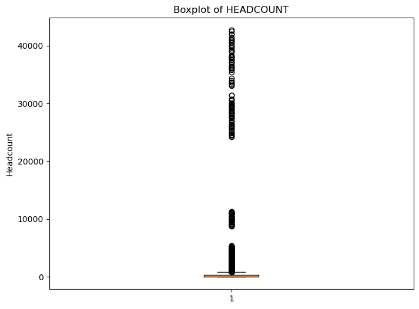
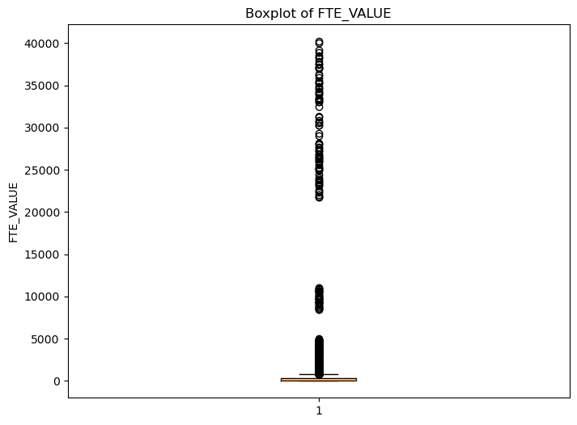
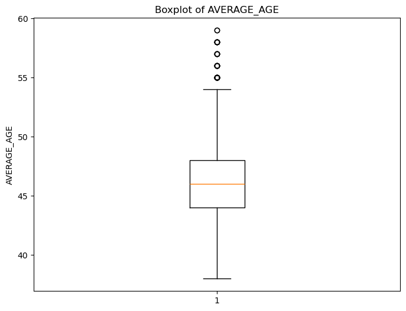
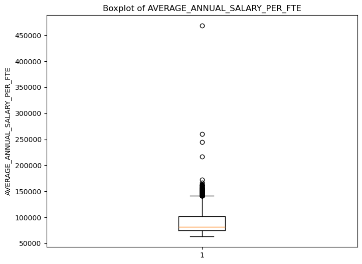
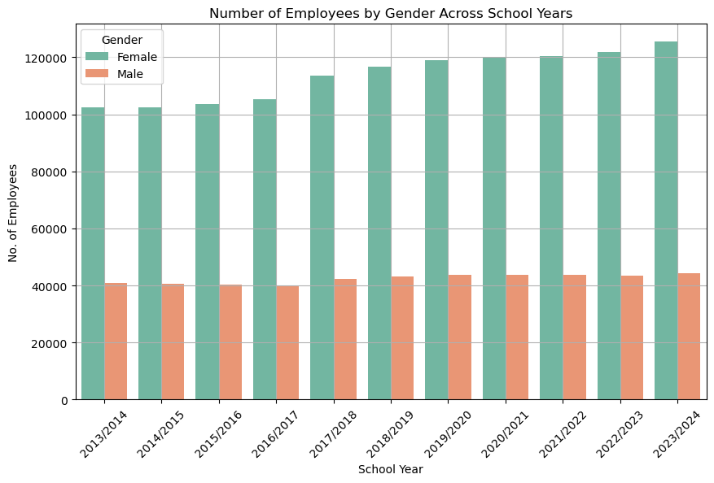
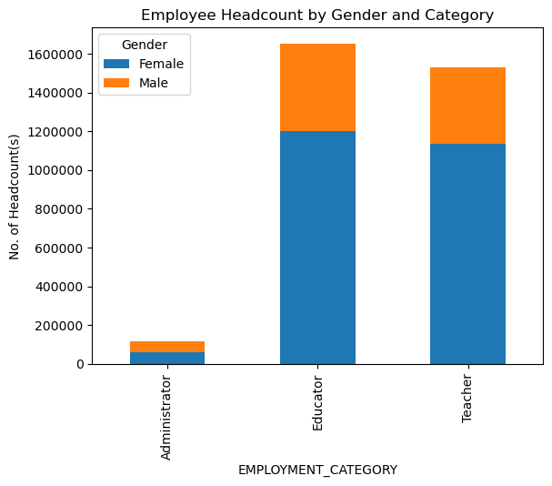

# Assignment 3: A baby project (Britch Columbia Public School Teacher Statistics)

### Author: Lee Kai Lok (Set 4J)

_Date: 24 Jan 2025_


#### Data Source
https://catalogue.data.gov.bc.ca/dataset/bc-schools-teacher-statistics

* The data is sourced from the BC Data Catalogue. 
* The data comprises __British Columbia Public School Teacher Statistics__ , including all data used in public reports up to 2023/2024.
* Comprehensive reports that outline the workforce statistics, including breakdowns by school year, gender, and other demographic variables.
* Data Tables: Structured datasets available in CSV format that provide detailed statistics for each school year within the specified range.
* It provides insights into various aspects of the educational workforce, including headcount, gender distribution, and other demographic factors. It includes the following attributes:

1. Data Level
2. SCHOOL_YEAR
3. REPORTING_PERIOD
4. DISTRICT_NUMBER
5. DISTRICT_NAME
6. EMPLOYMENT_CATEGORY
7. GENDER
8. HEADCOUNT
9. FTE_VALUE
10. AVERAGE_AGE
11. AVERAGE_ANNUAL_SALARY_PER_FTE

#### Data Range
* The data covers the following academic years, with Q1 and Q3 summarized data from 2013 to 2024.

#### Purpose of the Analysis
* The analysis aims to provide a comprehensive understanding of the trends and changes within the BC education workforce over the specified period. It will help identify patterns in workforce demographics, inform planning and resource allocation, and contribute to discussions around equity and representation in the education system.

#### Import the source file


```python
# Import bc_education_workforce_public_schools_2013_14_to_2023_24.csv as pandas DataFrame
import pandas 

## Use the following two graphic packages
import matplotlib.pyplot as plt
import seaborn as sns

from matplotlib.ticker import FuncFormatter

import re ## this for the regular expression work. 
import numpy as np


pandas.set_option('display.max_rows', None)  # Show all rows
pandas.set_option('display.max_columns', None)  # Show all columns

## and make sure our plots look good: % is pronounced "magic" which is fun
%matplotlib inline

# Import the CSV file as a pandas DataFrame
# the source data is located in data/raw folder
df = pandas.read_csv('../../data/raw/bc_education_workforce_public_schools_2013_14_to_2023_24.csv')
```

#### Summary of the data


```python
# Count The Number of Rows and Columns in the file 
print ("There are: ", df.shape[0], " rows and ", df.shape[1], " columns")
print ("")

# Generate all descriptive statistics. (Round in 2 dec. places)
print("")
print("The following is all descriptive statistics")
print(df.describe(include="all").round(2))


# Display the data type in each columns
print("")
print("The following is the data types of all attributes")
df.dtypes

```

    There are:  11523  rows and  11  columns
    
    
    The following is all descriptive statistics
                Data Level SCHOOL_YEAR REPORTING_PERIOD DISTRICT_NUMBER  \
    count            11523       11523            11523           11523   
    unique               2          11                2              61   
    top     District Level   2015/2016               Q1               5   
    freq             11334        1098             6036             189   
    
                 DISTRICT_NAME EMPLOYMENT_CATEGORY GENDER HEADCOUNT FTE_VALUE  \
    count                11523               11523  11523     11523     11523   
    unique                  61                   3      3      1668      7684   
    top     Southeast Kootenay            Educator    All       Msk       Msk   
    freq                   189                3843   3843      1133      1133   
    
           AVERAGE_AGE AVERAGE_ANNUAL_SALARY_PER_FTE  
    count        11523                         11523  
    unique          23                          9078  
    top             44                           Msk  
    freq          1799                          1133  
    
    The following is the data types of all attributes
    


    Data Level                       object
    SCHOOL_YEAR                      object
    REPORTING_PERIOD                 object
    DISTRICT_NUMBER                  object
    DISTRICT_NAME                    object
    EMPLOYMENT_CATEGORY              object
    GENDER                           object
    HEADCOUNT                        object
    FTE_VALUE                        object
    AVERAGE_AGE                      object
    AVERAGE_ANNUAL_SALARY_PER_FTE    object
    dtype: object


```python
# Count the number of figures are masked
print("No. of Records were marked:", df.query("HEADCOUNT=='Msk'").shape[0])
# 1133 records are masked. 

# eliminate these mask records before we analyze the data
df_new = df.query("HEADCOUNT!='Msk'")


df_new = df_new.copy()


# Convert the data type to a number for the columns with values 
df_new["HEADCOUNT"] =  pandas.to_numeric(df_new['HEADCOUNT'])
df_new["FTE_VALUE"] =  pandas.to_numeric(df_new['FTE_VALUE'])
df_new["AVERAGE_AGE"] =  pandas.to_numeric(df_new['AVERAGE_AGE'])
df_new["AVERAGE_ANNUAL_SALARY_PER_FTE"] =  pandas.to_numeric(df_new['AVERAGE_ANNUAL_SALARY_PER_FTE'])


# Check the latest data type in each column

print("")
print("The following is the updated data types of all attributes")

df_new.dtypes

```

    No. of Records were marked: 1133
    
    The following is the updated data types of all attributes
    


    Data Level                        object
    SCHOOL_YEAR                       object
    REPORTING_PERIOD                  object
    DISTRICT_NUMBER                   object
    DISTRICT_NAME                     object
    EMPLOYMENT_CATEGORY               object
    GENDER                            object
    HEADCOUNT                          int64
    FTE_VALUE                        float64
    AVERAGE_AGE                        int64
    AVERAGE_ANNUAL_SALARY_PER_FTE      int64
    dtype: object


#### Data Quality Check - The outliers

* By Boxplot Diagram


```python


# Create a boxplot for 4 numeric attributes: Headcount, FTE Values, Average Age, and Average Annual Salary Per FTE

# Check the outliers - HEADCOUNT
plt.figure(figsize=(8, 6))
plt.boxplot(df_new['HEADCOUNT'])
plt.title('Boxplot of HEADCOUNT')
plt.ylabel('Headcount')
# Export the graphical presentation into visualization folder 
plt.savefig('../../visualization/boxplot_headcount.png', format='png', dpi=300) 
plt.show()

# Check the outliers - FTE Value
plt.figure(figsize=(8, 6))
plt.boxplot(df_new['FTE_VALUE'])
plt.title('Boxplot of FTE_VALUE')
plt.ylabel('FTE_VALUE')
# Export the graphical presentation into visualization folder 
plt.savefig('../../visualization/boxplot_FTE_VALUE.png', format='png', dpi=300) 
plt.show()

# Check the outliers - Average Age
plt.figure(figsize=(8, 6))
plt.boxplot(df_new['AVERAGE_AGE'])
plt.title('Boxplot of AVERAGE_AGE')
plt.ylabel('AVERAGE_AGE')
# Export the graphical presentation into visualization folder 
plt.savefig('../../visualization/boxplot_AVERAGE_AGE.png', format='png', dpi=300) 
plt.show()

# Check the outliers - Annual Salary Per FTE
plt.figure(figsize=(8, 6))
plt.boxplot(df_new['AVERAGE_ANNUAL_SALARY_PER_FTE'])
plt.title('Boxplot of AVERAGE_ANNUAL_SALARY_PER_FTE')
plt.ylabel('AVERAGE_ANNUAL_SALARY_PER_FTE')
# Export the graphical presentation into visualization folder 
plt.savefig('../../visualization/boxplot_AVERAGE_ANNUAL_SALARY_PER_FTE.png', format='png', dpi=300) 
plt.show()


```


    

    


    

    


    

    


    

    


* Calcuate the Number of Outliers 


```python
# This is the function to calculate the no. of outliers
def count_outliers(feature, chatty=True):

    feat = feature
    # Calculate Q1, Q3, IQR, lower bound / upper bound values
    Q1 = feat.quantile(0.25)
    Q3 = feat.quantile(0.75)
    IQR = Q3 - Q1

    # Calculate lower and upper bounds
    lower_bound = Q1 - 1.5 * IQR
    upper_bound = Q3 + 1.5 * IQR

    if chatty:
        print("Q1:", Q1)
        print("Q3:", Q3)
        print("IQR:", IQR)
        print("Lower Bound:", lower_bound)
        print("Upper Bound:", upper_bound)

    # Identify outliers
    outliers = feat[(feat < lower_bound) | (feat > upper_bound)]
    outlier_count = outliers.count()  # Count how many outliers

    if chatty:
        print("Number of outliers:", outlier_count)

    # Clean the data by replacing outliers with NaN
    feat_cleaned = feat.where((feat >= lower_bound) & (feat <= upper_bound), np.nan)

      # Return both the cleaned data and the count of outliers
    return feat_cleaned, outlier_count
```


```python
# Filter out rows where GENDER != 'All'
filtered_df =df_new.query("GENDER !='All'")


filtered_df = filtered_df.copy()

# Count no. of records in the data set
print ("Number to total records: ", filtered_df.shape[0])


# Count and Display the number of outliers in the attribute - HEADCOUNT
filtered_df['HEADCOUNT'], headcount_outliers = count_outliers(filtered_df['HEADCOUNT'], False)

print("")
print("")
print("Total Number of Outliers - HEADCOUNT:",headcount_outliers  )

# Count and Display the number of outliers in the attribute - AVERAGE AGE
filtered_df['AVERAGE_AGE'], age_outliers = count_outliers(filtered_df['AVERAGE_AGE'], False)
print("")
print("")
print("Total Number of Outliers - AVERAGE_AGE:",age_outliers  )


# Count and Display the number of outliers in the attribute - FTE Value
filtered_df['FTE_VALUE'], fte_outliers = count_outliers(filtered_df['FTE_VALUE'], False)
print("")
print("")
print("Total Number of Outliers - FTE_VALUE:",fte_outliers  )

# Count and Display the number of outliers in the attribute - Average annual salary per fte
filtered_df['AVERAGE_ANNUAL_SALARY_PER_FTE'], salary_outliers = count_outliers(filtered_df['AVERAGE_ANNUAL_SALARY_PER_FTE'], False)
print("")
print("")
print("Total Number of Outliers - AVERAGE_ANNUAL_SALARY_PER_FTE:",salary_outliers  )


```

    Number to total records:  6689
    
    
    Total Number of Outliers - HEADCOUNT: 775
    
    
    Total Number of Outliers - AVERAGE_AGE: 23
    
    
    Total Number of Outliers - FTE_VALUE: 769
    
    
    Total Number of Outliers - AVERAGE_ANNUAL_SALARY_PER_FTE: 262
    

#### Clean the masked data to facilitate to data analysis


```python
## # This function used to clean the numeric data values  
def clean_numbers(word):

    # Check the data type of the parameter if it's integer or floating number, then directly return
    if isinstance(word, (int, float)):
        return word
    # If it's a character, try to pull out numbers
    elif isinstance(word, str):
        match = re.search(r"[-+]?\d*\.?\d+", word)
        if match:
            if '.' in match.group():
                return float(match.group())
            else:
                return int(match.group())
    # If there is nothing, make it an NA value
    else:
        return np.nan


# Clean the following 4 numeric columns
df_new_clean = df
df_new_clean["HEADCOUNT"] = df_new_clean["HEADCOUNT"].apply(clean_numbers)
df_new_clean["FTE_VALUE"] = df_new_clean["FTE_VALUE"].apply(clean_numbers)
df_new_clean["AVERAGE_AGE"] = df_new_clean["AVERAGE_AGE"].apply(clean_numbers)
df_new_clean["AVERAGE_ANNUAL_SALARY_PER_FTE"] = df_new_clean["AVERAGE_ANNUAL_SALARY_PER_FTE"].apply(clean_numbers)

# check number of masked record after data clean 
print("No. of Records were marked (after data clean):", df_new_clean.query("HEADCOUNT=='Msk'").shape[0])
# 0 record is expected
```

    No. of Records were marked (after data clean): 0
    

### Usage
To explore the datasets and analyses, it provides: 

* __Informed Workforce Planning__: The analysis provides insights into teacher demographics and trends, enabling effective workforce planning and resource allocation to address staffing needs in particular districts 

* __Promotion of Equity and Diversity__: By examining gender distribution and other demographic factors in each district, the findings can guide initiatives aimed at enhancing equity and representation within the teaching workforce. For instance, the data reveals that the number of female teachers is significantly larger than that of male teachers across all three types of occupations over the past years. This insight could inform policies that encourage more male candidates to consider careers in education, helping to balance gender representation in the workforce.

* __Academic Studies__: Provide a foundation for academic research related to teacher demographics, retention rates, and student outcomes, contributing to the broader field of education studies.


#### Data Visualization - Graph

##### Graph 1 - Line Graph 

__Insight__

* The upward trend in headcount can inform future planning and resource allocation, indicating a need for continued support for employee growth and development.


```python

# Graph 1 - Line Graph
# Show the total headcount by year


## In order to avoid duplication count, exclude record gener = male and female and calculate "All" Records only and focus on Q1 data
filtered_df = df_new_clean[(df_new_clean['GENDER'] == 'All' )& (df_new_clean['REPORTING_PERIOD'] == 'Q1')]

# Group by SCHOOL_YEAR and sum HEADCOUNT
yearly_headcount = filtered_df.groupby('SCHOOL_YEAR')['HEADCOUNT'].sum().reset_index()

# Plotting
plt.figure(figsize=(8, 6))
plt.plot(yearly_headcount['SCHOOL_YEAR'], yearly_headcount['HEADCOUNT'], color='green', marker= 'o')
plt.title('Total Headcount for All Genders by School Year')
plt.xlabel('School Year')
plt.ylabel('Total Headcount')
plt.xticks(rotation=45)

# Save the graph into visualization folder
plt.savefig('../../visualization/linechart.png', format='png', dpi=300) 
plt.show()

```


    

    


##### Graph 2 - Column Graph

__Insight__

* The graph highlights a noticeable gender disparity, with male employees consistently outnumbering female employees across all school years.


```python
# Graph 2 - Column Graph


## In order to avoid duplication count, exclude record gener = male and female and calculate "All" Records only and focus on Q1 data
filtered_df = df_new_clean[(df_new_clean['GENDER'] != 'All' )& (df_new_clean['REPORTING_PERIOD'] == 'Q1') ]

# Group by SCHOOL_YEAR and sum HEADCOUNT
yearly_headcount = filtered_df.groupby(['SCHOOL_YEAR','GENDER'])['HEADCOUNT'].sum().reset_index()

yearly_headcount.head(3)

plt.figure(figsize=(10, 6))
 

sns.barplot(x="SCHOOL_YEAR", y="HEADCOUNT", hue="GENDER", data=yearly_headcount, palette="Set2")

plt.title("Number of Employees by Gender Across School Years")
plt.xlabel("School Year")
plt.ylabel("No. of Employees")
plt.legend(title="Gender")
plt.grid(True)
plt.xticks(rotation=45)

# Save the graph into visualization folder
plt.savefig('../../visualization/barchart.png', format='png', dpi=300) 
plt.show()
```


    

    


##### Graph 3 - Stacked Column Graph

__Insight__

* The administrative category has notably fewer employees compared to educators and teachers. This could imply a lean administrative structure in BC. 


```python
# Graph 3 - Stacked Column Graph 

fig, ax = plt.subplots()

df_new_clean.query("GENDER!='All'").groupby(['EMPLOYMENT_CATEGORY', 'GENDER'])["HEADCOUNT"].sum().reset_index()\
                    .pivot_table(index='EMPLOYMENT_CATEGORY', columns='GENDER', values='HEADCOUNT')\
                    .plot(kind='bar', stacked=True, ax=ax)

ax.legend(title='Gender')
ax.set_ylabel('No. of Headcount(s)')
ax.set_title('Employee Headcount by Gender and Category')
plt.gca().yaxis.set_major_formatter(FuncFormatter(lambda x, _: int(x)))

# Save the graph into the visualization folder
plt.savefig('../../visualization/stackbar.png', format='png', dpi=300) 
plt.show()


```


    

    


#### Data Visualization - Summary

##### Summary 1 - The number of headcount by school year, reporting period and employment category

__Insight__

* When compare the total headcounts between Q1 and Q4 in each school year, there is an overall upward trend except for the school year 2019-2020 - the number of teachers in Q4 is smaller than in Q1. This decrease may be the impact of the pandemic, which could have led to temporary school closures. Further investigation may be required to understand the underlying factors contributing to this special fluctuation.


```python
# Summary 1
# The Pivot table show the number of headcount by school year, reporting period and employment category
df_new_all_gender = df_new_clean.query("GENDER == 'All'"); 

                     
print(df_new_all_gender.pivot_table(index = ['SCHOOL_YEAR', 'REPORTING_PERIOD', 'EMPLOYMENT_CATEGORY'], 
                              values = ['HEADCOUNT'], 
                              aggfunc = ['sum']))

```

                                                           sum
                                                     HEADCOUNT
    SCHOOL_YEAR REPORTING_PERIOD EMPLOYMENT_CATEGORY          
    2013/2014   Q1               Administrator          5446.0
                                 Educator              71870.0
                                 Teacher               66377.0
                Q4               Administrator          5435.0
                                 Educator              72827.0
                                 Teacher               67343.0
    2014/2015   Q1               Administrator          5426.0
                                 Educator              71631.0
                                 Teacher               66160.0
                Q4               Administrator          5382.0
                                 Educator              73406.0
                                 Teacher               67980.0
    2015/2016   Q1               Administrator          5410.0
                                 Educator              72149.0
                                 Teacher               66694.0
                Q4               Administrator          5410.0
                                 Educator              74184.0
                                 Teacher               68729.0
    2016/2017   Q1               Administrator          5432.0
                                 Educator              72865.0
                                 Teacher               67405.0
                Q4               Administrator          5480.0
                                 Educator              76280.0
                                 Teacher               70772.0
    2017/2018   Q1               Administrator          5557.0
                                 Educator              78141.0
                                 Teacher               72540.0
                Q4               Administrator          5649.0
                                 Educator              80082.0
                                 Teacher               74395.0
    2018/2019   Q1               Administrator          5726.0
                                 Educator              80049.0
                                 Teacher               74278.0
                Q4               Administrator          5726.0
                                 Educator              81168.0
                                 Teacher               75399.0
    2019/2020   Q1               Administrator          5825.0
                                 Educator              81508.0
                                 Teacher               75651.0
                Q4               Administrator          5854.0
                                 Educator              80896.0
                                 Teacher               75012.0
    2020/2021   Q1               Administrator          5908.0
                                 Educator              82038.0
                                 Teacher               76084.0
                Q4               Administrator          5883.0
                                 Educator              84084.0
                                 Teacher               78175.0
    2021/2022   Q1               Administrator          5918.0
                                 Educator              82138.0
                                 Teacher               76171.0
                Q4               Administrator          5963.0
                                 Educator              83953.0
                                 Teacher               77947.0
    2022/2023   Q1               Administrator          5981.0
                                 Educator              82807.0
                                 Teacher               76777.0
                Q4               Administrator          6091.0
                                 Educator              85433.0
                                 Teacher               79329.0
    2023/2024   Q1               Administrator          6175.0
                                 Educator              84968.0
                                 Teacher               78797.0
    

##### Summary 2 - The number of average headcounts by district 
__Insight__

* The range of headcounts indicates diversity in district sizes and resources, which may influence staffing, student-to-teacher ratios, and educational outcomes. For instance, BC Public Schools, Surrey, and Vancouver have the highest average headcounts in British Columbia, reflecting their larger populations and potentially greater educational needs.


```python
# Summary 2 
# Show the number of headcounts by districts in BC
df_district = df_new_clean.groupby(["DISTRICT_NAME"])["HEADCOUNT"].mean().round(2).sort_values(ascending=False)

print(df_district)

```

    DISTRICT_NAME
    BC Public Schools               17472.99
    Surrey                           2156.04
    Vancouver                        1522.80
    Coquitlam                        1003.66
    Burnaby                           818.34
    Langley                           691.85
    Central Okanagan                  681.19
    Richmond                          670.54
    Greater Victoria                  641.51
    Abbotsford                        583.43
    Delta                             515.33
    North Vancouver                   504.11
    Maple Ridge-Pitt Meadows          471.79
    Kamloops-Thompson                 451.60
    Nanaimo-Ladysmith                 423.35
    Prince George                     404.52
    Chilliwack                        403.64
    Sooke                             341.46
    Comox Valley                      267.96
    Vernon                            265.89
    Cowichan Valley                   257.65
    Saanich                           241.69
    Conseil scolaire francophone      234.11
    West Vancouver                    228.04
    New Westminster                   218.69
    North Okanagan-Shuswap            211.21
    Mission                           194.68
    Peace River North                 183.89
    Southeast Kootenay                180.17
    Okanagan Skaha                    179.58
    Campbell River                    174.21
    Sea To Sky                        171.09
    Kootenay Lake                     158.26
    Cariboo-Chilcotin                 155.84
    Coast Mountains                   149.44
    Qualicum                          140.46
    Kootenay-Columbia                 129.57
    Sunshine Coast                    129.52
    Nechako Lakes                     129.22
    Pacific Rim                       127.28
    Quesnel                           126.77
    Peace River South                 125.18
    Rocky Mountain                    104.74
    Okanagan Similkameen              102.41
    qathet                             98.24
    Nicola-Similkameen                 93.79
    Prince Rupert                      92.00
    Bulkley Valley                     79.19
    Gulf Islands                       76.43
    Fraser-Cascade                     74.99
    Vancouver Island North             57.13
    Boundary                           57.04
    Gold Trail                         53.58
    Revelstoke                         53.18
    Haida Gwaii                        34.49
    Fort Nelson                        34.11
    Arrow Lakes                        30.09
    Vancouver Island West              27.72
    Nisga'a                            27.09
    Central Coast                      23.33
    Stikine                            18.77
    Name: HEADCOUNT, dtype: float64
    

#### Output the cleaned data 


```python

# Export the cleaned data 
df_new_clean.to_csv('../../data/cleaned/bc_education_workforce_public_schools_2013_14_to_2023_24_clean.csv', index=False)


```

#### Reference

* https://stackoverflow.com/questions/64858113/stacked-bar-chart-in-matplotlib
* https://stackoverflow.com/questions/40511476/how-to-properly-use-funcformatterfunc
* https://stackoverflow.com/questions/52241417/how-do-i-change-a-bar-graph-to-a-line-graph-in-python
* https://stackoverflow.com/questions/78469275/to-numeric-adds-a-decimal-to-all-numeric-values
* https://stackoverflow.com/questions/31761723/python-pandas-display-all-rows-without-omitting
* https://stackoverflow.com/questions/27018622/pandas-groupby-sort-descending-order


